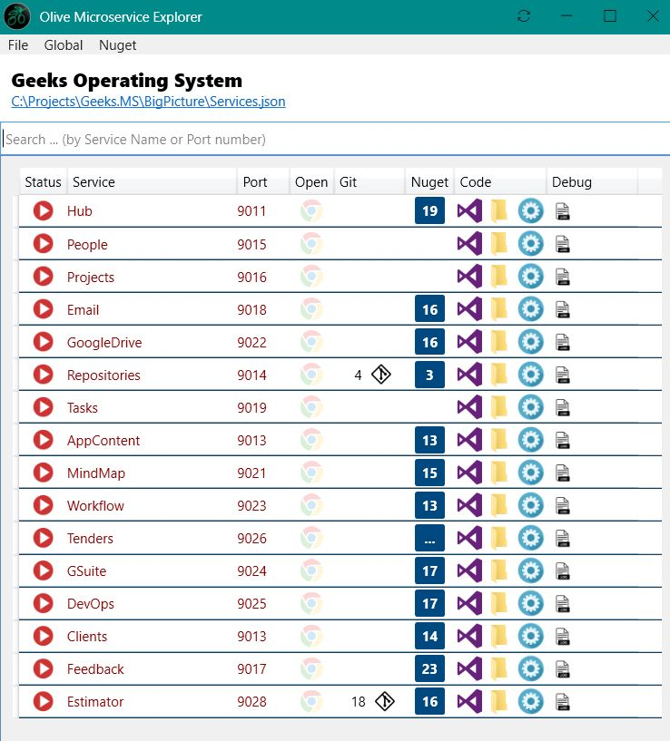

# Olive Microservice Explorer

A typical solution may have tens of microservice projects. During development, you usually will have a root folder for the entire solution, with a sub-folder per microservice project inside it. 

Unlike traditional model where a large solution can still be a single Visual Studio solution (with multiple projects inside it), in Microservices, each microservice project will be an independant Visual Studio solution, with a separate GIT repository, access permissions, etc. This can make it hard to see the big picture in one view.

This utility will solve that problem, by providing a high level management tool. You can think of it as a complementory tool to Visual Studio.

# How does it work?

When first running it, you should point it to the root folder of the solution.
It will then go through all sub-folders to determine if it's an Olive microservice. If it is, then it will generate a row on the UI.

 
